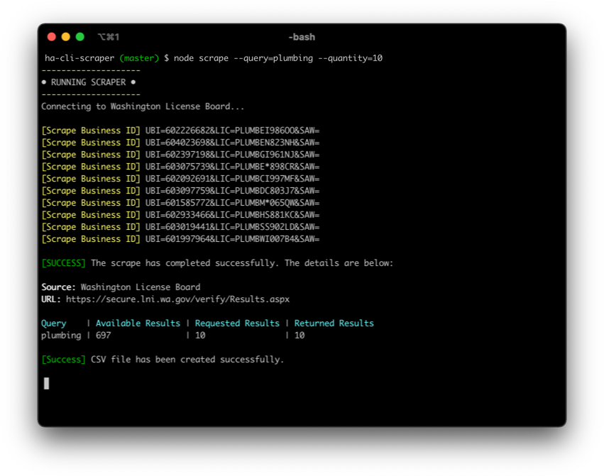

# ha-cli-scraper

Node based web scraping tool built for a sales team to help aggregate contractor lead data from the Washington License Board.

The scraped lead data is parsed and exported into a CSV file.

## 🚀 Quick start

1.  **Project Setup**

    Clone the project and install the dependencies

    ```shell
    git clone https://github.com/davidkim10/ha-cli-scraper
    cd ha-cli-scraper
    npm install
    ```

2.  **Basic Usage**

    ```shell
    node scrape --query=plumbing --quantity=10
    ```

    | Parameters | Description                          |
    | ---------- | ------------------------------------ |
    | query      | Enter keyword or desired search term |
    | quantity   | Desired quantity of lead results     |

## 📷 Screenshots


